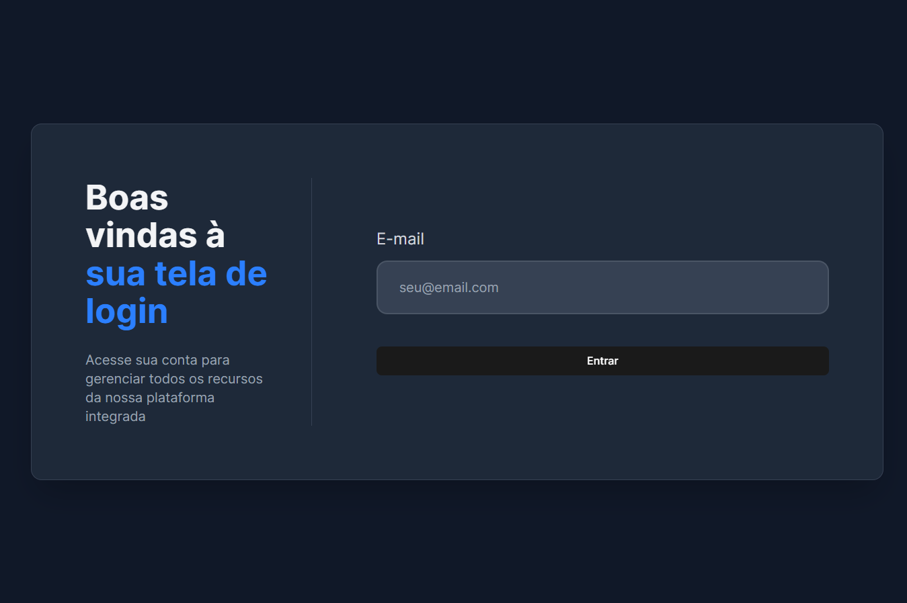

# 📌 Projeto: Tela de Login com React, Tailwind e Vite

## 🚀 Sobre o Projeto
Este projeto é uma tela de login responsiva desenvolvida com **React**, estilizada com **Tailwind CSS** e configurada com **Vite**. Ele tem o objetivo de demonstrar minhas habilidades no desenvolvimento de interfaces modernas, utilizando boas práticas de estilização e organização de código.

## 🎨 Tecnologias Utilizadas
- **React** - Biblioteca JavaScript para construção de interfaces
- **Tailwind CSS** - Framework de estilização baseado em classes utilitárias
- **Vite** - Ferramenta moderna para build e desenvolvimento rápido de aplicações frontend

## 📷 Captura de Tela


## 📂 Estrutura do Projeto
```
📦 meu-projeto
├── 📂 src
│   ├── 📂 components
│   │   ├── Login.jsx
│   ├── 📂 assets
│   ├── App.jsx
│   ├── main.jsx
├── 📜 index.html
├── 📜 package.json
├── 📜 tailwind.config.js
├── 📜 vite.config.js
├── 📜 README.md
```

## 🛠️ Como Rodar o Projeto
Siga os passos abaixo para executar o projeto localmente:

### 1️⃣ Clone o repositório:
```bash
git clone git@github.com:andersonssantana/login-tailwind.git
```

### 2️⃣ Acesse a pasta do projeto:
```bash
cd login-tailwind
```

### 3️⃣ Instale as dependências:
```bash
npm install
```

### 4️⃣ Execute o servidor de desenvolvimento:
```bash
npm run dev
```

### 5️⃣ Acesse no navegador:
Abra [http://localhost:5173](http://localhost:5173) para ver o projeto rodando.

## ✨ Funcionalidades
✅ Tela de login totalmente responsiva<br>
✅ Validação de e-mail no formulário<br>
✅ Layout moderno e estilizado com Tailwind CSS<br>
✅ Código organizado e fácil de manter<br>

## 📜 Licença
Este projeto está sob a licença MIT. Sinta-se à vontade para usá-lo, modificá-lo e distribuí-lo conforme necessário.

---
Feito com 💙 por **[Ander](https://github.com/andersonssantana)**
